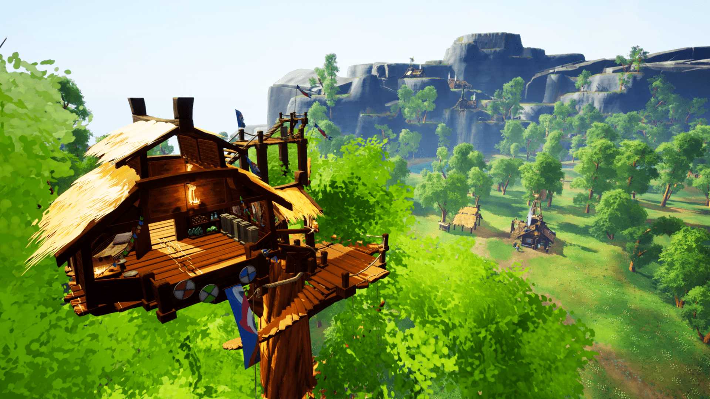
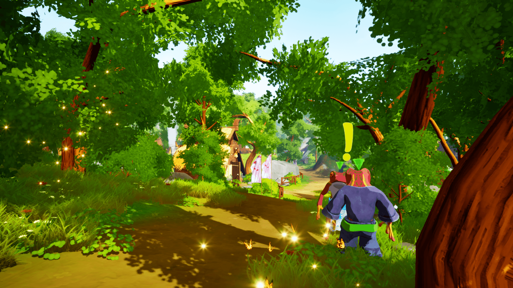
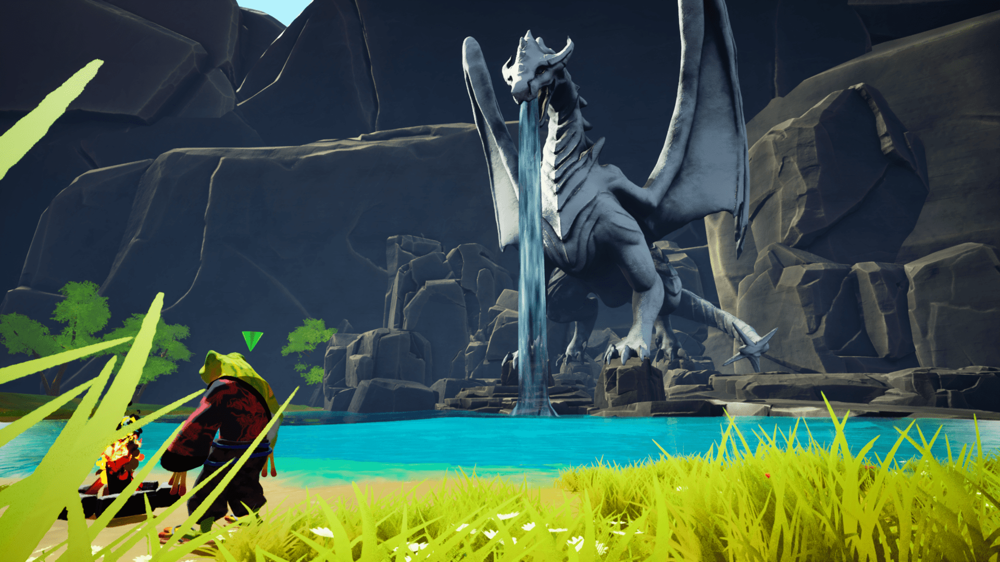

[Download on itch](https://s4g.itch.io/cozytales) -
[Project Page](https://mondanzo.de/#cozytales)

**Notice: The version uploaded here is a showcase variant with only the necessary features added.**

[Download Showcase Build here](https://github.com/Mondanzo/Cozytales/releases/)

# About

Step into Akai’s world of calm exploration, discovering a cozy gaming adventure! Cozy Tales is more than just a game; it's a comforting escape into a serene and charming world. Here, players are invited to immerse themselves in a peaceful adventure, turning maps into stories and guiding future adventurers.

## Key Informations:
Engine: Unreal 5.3

Team Size: 10 people

Platform: PC

Genre: Exploration Adventure

Participation Duration: 4 weeks

Release: 14.2.2024

Number of Players: Single Player

# Role in the team

- late joiner (only participated for 4 / 10 weeks.)
- Gameplay Programmer
- UI Programmer
- Profiling

# Tasks in the project

- Profiling, Debugging and Performance Optimisation
- Tutorial System
- [Extending the Quest System](Content/Blueprints/Systems/QuestSystem/)
  - Added option to (de)activate actors based on quest status.
  - Updated Placement of Quest Markers to be more reliable and spatially designed.
- [Improving the Player Movement](Content/Blueprints/Characters/HeroCharacter/)
- Controller Support 
  -> All over the place!
- UI Menu Programming
  - [Various Menus](Content/UI/Menus)
  - [Custom Decorator for Controller Icons](Content/UI/Decorators) 
    -> retrospective should have used Common UI for various situations.
- [Player Map](Content/Blueprints/Systems/QuestMap)
  - "Fog of War"
  - Placement via Mouse and Controller
- Smaller Gimmicks
  - [Compass](Content/Blueprints/Systems/Locations/BP_Compass.uasset)
  - Logo (yes that was me)

# Learnings taken

- first bigger experience in Unreal
  - with C++ as well
- Did not take enough effort into finding pre-created Unreal solutions.
  - example UI Programming could have benefitted from Common UI
- TODO: Extend (haha yes.)

# Screenshots

